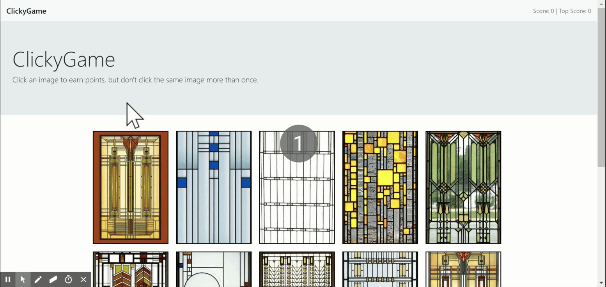

# ClickyGame
A React.js application that allows a user to earn points by clicking on different cards, with the game ending when the same card is clicked twice.

## Overview
A single page React application, with the logic handled almost entirely by App.js, which stores the application data in its state including:
* top score
* current running score
* array of cards
* array of cards already guessed
* answer feedback

Upon mounting, App.js shuffles cards and renders them as CardList components on the page using the array.protoype.map() method. A click handler callback function is passed to the CardList components as props so that when clicked, it will update the state on the parent component (App.js). 

The scoreboard data is passed to the Header component as props, which is then rendered for the user. A componentDidUpdate function is called on the Header component so that it updates when the state on the parent component changes.

## Functionality

